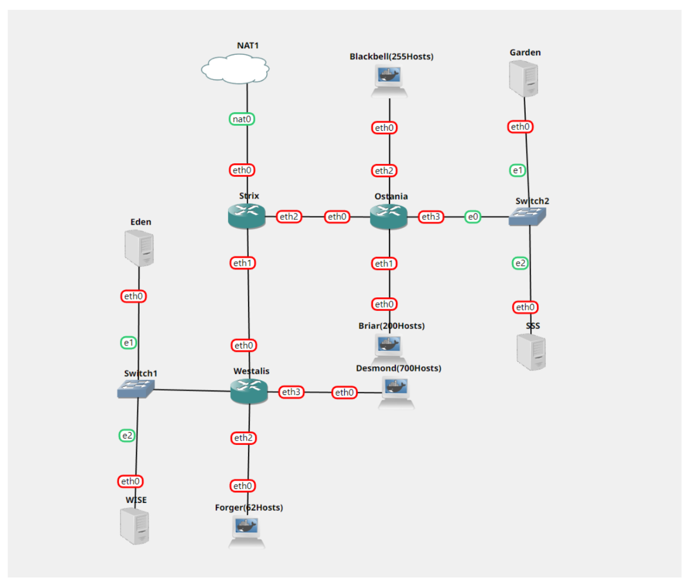
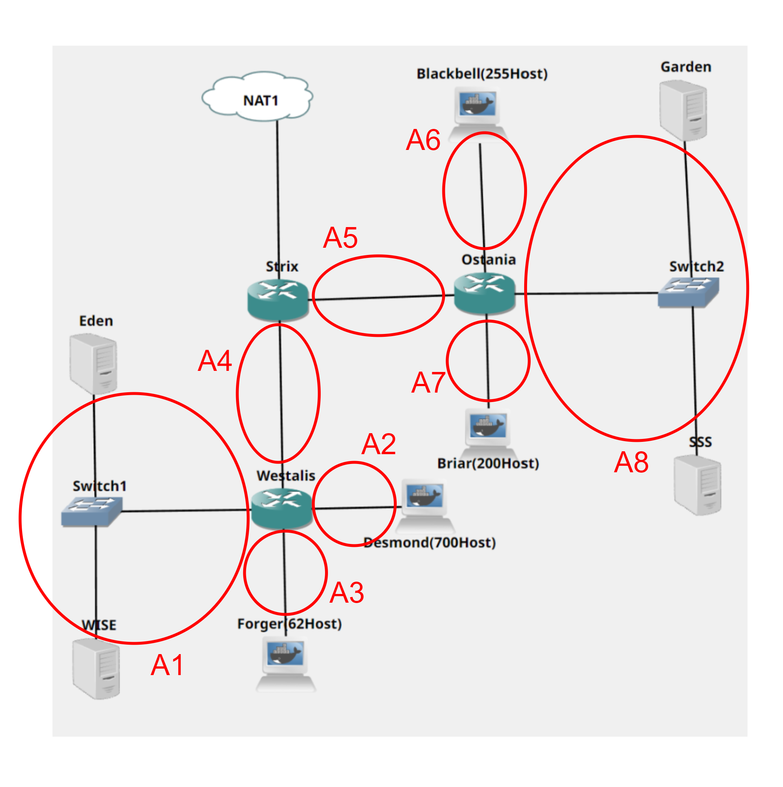
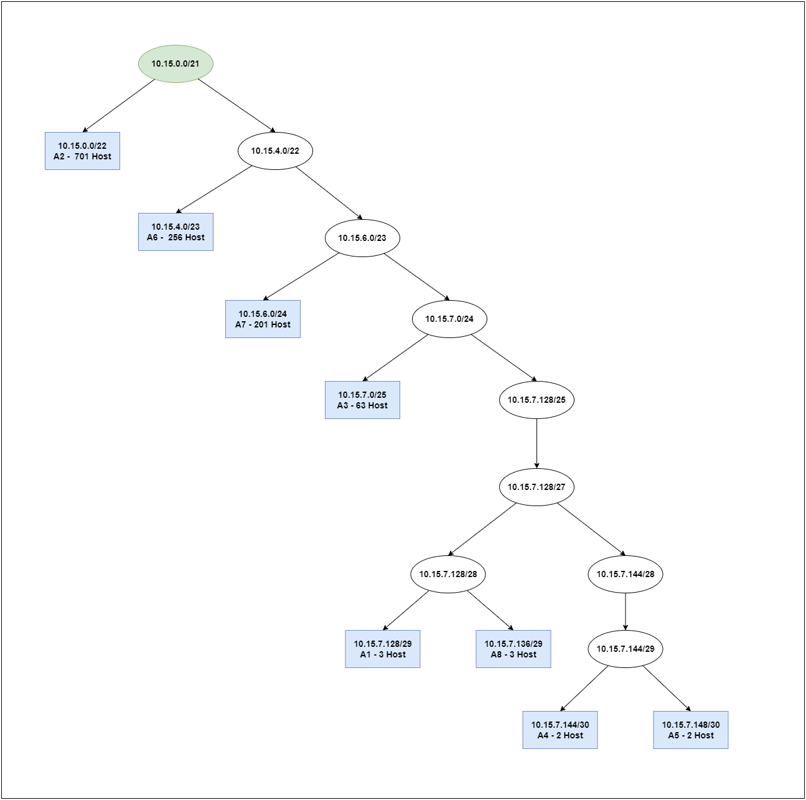

# **Jarkom-Modul-5-C11-2022**

*Repository* ini berisi laporan resmi dari praktikum modul 5 dari mata kuliah Jaringan Komputer tahun 2022.

</br>

## **Data Diri**
| Nama | Kelas-Kelompok | NRP |
| ------------- | ------------- | ------------- |
| Nur Muhammad Ainul Yaqin | C-11 | 5025201011 |

</br>

## **Persiapan**

Sebagai persiapan, terdapat beberapa poin yang harus dilakukan yang tertuang dalam soal sebagai berikut.


### **Persiapan 1**

**Tugas pertama kalian yaitu membuat topologi jaringan sesuai dengan rancangan yang diberikan Loid dibawah ini.**

Pada poin ini, telah dibuat topologi pada GNS3 sebagai berikut.



Nantinya, terdapat beberapa node yang memiliki peran khusus, yaitu sebagai berikut.

- Eden adalah DNS Server
- WISE adalah DHCP Server
- Garden dan SSS adalah Web Server
- Jumlah Host pada Forger adalah 62 host
- Jumlah Host pada Desmond adalah 700 host
- Jumlah Host pada Blackbell adalah 255 host
- Jumlah Host pada Briar adalah 200 host

</br>

### **Persiapan 2**

**Untuk menjaga perdamaian dunia, Loid ingin meminta kalian untuk membuat topologi tersebut menggunakan teknik CIDR atau VLSM setelah melakukan subnetting.**

Pada poin ini, dilakukan perhitungan subnetting dengan menggunakan metode VLSM. Metode ini diawali dengan melakukan pengelompokan pada topologi yang telah dibuat sebagai berikut.



Selanjutnya, dilakukan analisis sehingga didapatkan hasil sebagai berikut.

| Subnet | Jumlah IP Host | Netmask |
| ------------- | ------------- | ------------- |
| A1 | 3 | /29
| A2 | 701 | /22
| A3 | 63 | /25
| A4 | 2 | /30
| A5 | 2 | /30
| A6 | 256 | /23
| A7 | 201 | /24
| A8 | 3 | /29


Berdasarkan total IP host dan netmask yang dibutuhkan, root subnet yang dibentuk memiliki NID 10.15.0.0 dengan netmask /21 dan jumlah IP Host sebanyak 1231. Kemudian, alokasi IP Address secara keseluruhan dapat dibuat menjadi seperti berikut.

| Subnet (Alias) | Jumlah IP Host | Alokasi | NID | Available Hosts | Broadcast Address | Netmask |
| ------------- | ------------- | ------------- | ------------- | ------------- | ------------- | ------------- |
| A2 | 701 | 1022 | 10.15.0.0 | 10.15.0.1 - 10.15.3.254 | 10.15.3.255 | 255.255.255.128
| A6 | 256 | 510 | 10.15.4.0 | 10.15.4.1 - 10.15.5.254 | 10.15.5.255 | 255.255.254.0
| A7 | 201 | 254 | 10.15.6.0 | 10.15.6.1 - 10.15.6.254 | 10.15.6.255 | 255.255.255.0
| A3 | 63 | 126 | 10.15.7.0 | 10.15.7.1 - 10.15.7.126 | 10.15.7.127 | 255.255.252.0
| A1 | 3 | 6 | 10.15.7.128 | 10.15.7.129 - 10.15.7.134 | 10.15.7.135 | 255.255.255.248
| A8 | 3 | 6 | 10.15.7.136 | 10.15.7.137 - 10.15.7.142 | 10.15.7.143 | 255.255.255.248
| A4 | 2 | 2 | 10.15.7.144 | 10.15.7.145 - 10.15.7.146 | 10.15.7.147 | 255.255.255.252
| A5 | 2 | 2 | 10.15.7.148 | 10.15.7.149 - 10.15.7.150 | 10.15.7.151 | 255.255.255.252


Tidak lupa, dibuat `IP Address Tree` untuk mempermudah visualisasi dari subnetting yang telah dibuat sebagai berikut.




</br>

### **Persiapan 3**

**Anya, putri pertama Loid, juga berpesan kepada anda agar melakukan Routing agar setiap perangkat pada jaringan tersebut dapat terhubung.**

Pada poin ini, dilakukan beberap konfigurasi yang meliputi konfigurasi IP Address tiap node, konfigurasi routing, serta konfigurasi node server.

- **Konfigurasi IP Address tiap Node**

    Strix

    ```bash
    auto eth0
    iface eth0 inet dhcp

    auto eth1
    iface eth1 inet static
        address 10.15.7.145
        netmask 255.255.255.252

    auto eth2
    iface eth2 inet static
        address 10.15.7.149
        netmask 255.255.255.252
    ```

    Westalis

    ```bash
    auto eth0
    iface eth0 inet static
        address 10.15.7.146
        netmask 255.255.255.252
    auto eth1
    iface eth1 inet static
        address 10.15.7.129
        netmask 255.255.255.248
    auto eth2
    iface eth2 inet static
        address 10.15.7.1
        netmask 255.255.255.128
    auto eth3
    iface eth3 inet static
        address 10.15.0.1
        netmask 255.255.252.0
    ```

    Ostania

    ```bash
    auto eth0
    iface eth0 inet static
        address 10.15.7.150
        netmask 255.255.255.252
    auto eth1
    iface eth1 inet static
        address  10.15.6.1
        netmask 255.255.255.0
    auto eth2
    iface eth2 inet static
        address  10.15.4.1
        netmask 255.255.254.0
    auto eth3
    iface eth3 inet static
        address  10.15.7.137
        netmask 255.255.255.248
    ```

    Eden

    ```bash
    auto eth0
    iface eth0 inet static
        address 10.15.7.130
        netmask 255.255.255.248
        gateway 10.15.7.129
    ```

    Wise
    
    ```bash
    auto eth0
    iface eth0 inet static
        address 10.15.7.131
        netmask 255.255.255.248
        gateway 10.15.7.129
    ```

    Garden 
    
    ```bash
    auto eth0
    iface eth0 inet static
        address 10.15.7.139
        netmask 255.255.255.248
        gateway 10.15.7.137
    ```

    SSS

    ```bash
    auto eth0
    iface eth0 inet static
        address 10.15.7.138
        netmask 255.255.255.248
        gateway 10.15.7.137
    ```

</br>

- **Konfigurasi Routing pada tiap Router**

    Strix

    ```bash
    route add -net 10.15.7.0 netmask 255.255.255.128 gw 10.15.7.146
    route add -net 10.15.0.0 netmask 255.255.252.0 gw 10.15.7.146
    route add -net 10.15.7.128 netmask 255.255.255.248 gw 10.15.7.146

    route add -net 10.15.4.0 netmask 255.255.254.0 gw 10.15.7.150 
    route add -net 10.15.6.0 netmask 255.255.255.0 gw 10.15.7.150 
    route add -net 10.15.7.136 netmask 255.255.255.248 gw 10.15.7.150 
    ```

    echo 'iptables -t nat -A POSTROUTING -o eth0 -j MASQUERADE -s 10.15.0.0/21 ' >> .bashrc

    Westalis
    
    ```bash
    route add -net 0.0.0.0 netmask 0.0.0.0 gw 10.15.7.145
    ```

    Ostania

    ```bash
    route add -net 0.0.0.0 netmask 0.0.0.0 gw 10.15.7.149
    ```

    Agar client bisa terhubung ke internet, perlu dilakukan konfigurasi iptables pada router yang berhubungan dengan NAT, yaitu Strix. Kemudian, simpan kedalam file `.bashrc`.

    ```bash
    echo 'iptables -t nat -A POSTROUTING -o eth0 -j MASQUERADE -s 10.15.0.0/16 ' >> .bashrc
    ```

</br>

- **Konfigurasi Node Server**

    Eden, digunakan sebagai DNS Server.

    ```bash
    echo 'nameserver 192.168.122.1 ' > /etc/resolv.conf

    apt update
    apt install bind9 -y

    echo '
    options {
        directory "/var/cache/bind";
        forwarders {
            192.168.122.1;
        };
        allow-query { any; };
        auth-nxdomain no;    # conform to RFC1035
        listen-on-v6 { any; };
    }; ‘ > /etc/bind/named.conf.options

    service bind9 restart
    ```

    Garden, digunakan sebagai Web Server.

    ```bash
    echo 'nameserver 192.168.122.1 ' > /etc/resolv.conf
    apt update
    apt install apache2 -y
    service apache2 start
    echo "$HOSTNAME" > /var/www/html/index.html
    ```

    SSS, digunakan sebagai Web Server.

    ```bash
    echo 'nameserver 192.168.122.1 ' > /etc/resolv.conf

    apt update
    apt install apache2 -y
    service apache2 start
    echo "$HOSTNAME" > /var/www/html/index.html
    ```

</br>

### **Persiapan 4**

**Tugas berikutnya adalah memberikan ip pada subnet Forger, Desmond, Blackbell, dan Briar secara dinamis menggunakan bantuan DHCP server. Kemudian kalian ingat bahwa kalian harus setting DHCP Relay pada router yang menghubungkannya.**

Pada poin ini, dilakukan konfigurasi pada Wise sebagai DHCP Server. Selain itu, karena node router yang berhubungan dengan host adalah Westalis dan Ostania, maka kedua node router tersebut perlu dikonfigurasi sebagai DHCP Relay. Terakhir, setiap node yang berhubungan dengan DHCP Relay perlu dikonfigurasi menjadi DHCP pada interface yang berhubungan.

- **Konfigurasi DHCP Server**

    WISE, menjadi satu-satunya DHCP Server dalam topologi ini

    ```bash
    echo 'nameserver 192.168.122.1 ' > /etc/resolv.conf

    apt update
    apt install isc-dhcp-server -y
    echo 'INTERFACES="eth0" ‘ > /etc/default/isc-dhcp-server

    echo 'ddns-update-style none;
    option domain-name "example.org";
    option domain-name-servers ns1.example.org, ns2.example.org;
    default-lease-time 600;
    max-lease-time 7200;
    log-facility local7;
    subnet 10.15.0.0 netmask 255.255.252.0 {
        range 10.15.0.2 10.15.3.254;
        option routers 10.15.0.1;
        option broadcast-address 10.15.3.255;
        option domain-name-servers 10.15.7.130;
        default-lease-time 360;
        max-lease-time 7200;
    }
    subnet 10.15.7.0 netmask 255.255.255.128 {
        range 10.15.7.2 10.15.7.126;
        option routers 10.15.7.1;
        option broadcast-address 10.15.7.127;
        option domain-name-servers 10.15.7.130;
        default-lease-time 720;
        max-lease-time 7200;
    }
    subnet 10.15.4.0 netmask 255.255.254.0 {
        range 10.15.4.2 10.15.5.254;
        option routers 10.15.4.1;
        option broadcast-address 10.15.5.255;
        option domain-name-servers 10.15.7.130;
        default-lease-time 720;
        max-lease-time 7200;
    }
    subnet 10.15.6.0 netmask 255.255.255.0 {
        range 10.15.6.2 10.15.6.254;
        option routers 10.15.6.1;
        option broadcast-address 10.15.6.255;
        option domain-name-servers 10.15.7.130;
        default-lease-time 720;
        max-lease-time 7200;
    }
    subnet 10.15.7.128 netmask 255.255.255.248 {}
    subnet 10.15.7.144 netmask 255.255.255.252 {}
    subnet 10.15.7.148 netmask 255.255.255.252 {}
    subnet 10.15.7.136 netmask 255.255.255.248 {} ‘ > /etc/dhcp/dhcpd.conf

    service isc-dhcp-server restart
    ```

- **Konfigurasi DHCP Relay**

    Westalis

    ```bash
    apt update
    apt install isc-dhcp-relay -y

    echo 'SERVERS="10.15.7.131"
    INTERFACES="eth2 eth3 eth0 eth1"
    OPTIONS="" ' > /etc/default/isc-dhcp-relay

    service isc-dhcp-relay restart
    ```

    Ostania

    ```bash
    apt update
    apt install isc-dhcp-relay -y

    echo 'SERVERS="10.15.7.131"
    INTERFACES="eth2 eth3 eth0 eth1"
    OPTIONS="" ' > /etc/default/isc-dhcp-relay

    service isc-dhcp-relay restart
    ```

- **Konfigurasi Interface Node Client**

    Blackbell, Briar, Desmond, dan Forger

    ```bash
    auto eth0
    iface eth0 inet dhcp
    ```

</br>

## **Laporan Pengerjaan Soal**

Bahasan mengenai pengerjaan soal berkaitan dengan Firewall terbagi menjadi enam poin disertai dengan penjelasan sebagai berikut.

### **Soal 1**
**Agar topologi yang kalian buat dapat mengakses keluar, kalian diminta untuk mengkonfigurasi Strix menggunakan iptables, tetapi Loid tidak ingin menggunakan MASQUERADE.**

Dengan menggunakan `iptables`, dilakukan konfigurasi agar topologi dapat mengakses internet keluar (NAT). Tanpa `MASQUERADE`, konfigurasi dilakukan dengan memanfaatkan scripting sederhana, yaitu dengan menggunakan `SNAT --to-source` yang mengarah pada NID dari router yang berhubungan dengan NAT, yaitu `10.15.0.0/21`.

Namun, sebelumnya perlu didefinisikan interface mana yang terkoneksi dengan NAT. Pada Strix, interface yang berhubungan adalah `eth0`. Definisi tersebut dapat dimasukkan ke dalam sebuah variabel. Di sini, digunakan variabel bernama `IPETH0`.

Sehingga, konfigurasi pada Strix adalah sebagai berikut.

```bash
IPETH0="$(ip -br a | grep eth0 | awk '{print $NF}' | cut -d'/' -f1)"
iptables -t nat -A POSTROUTING -o eth0 -j SNAT --to-source "$IPETH0" -s 10.15.0.0/21
```

Pengetesan dilakukan dengan melakukan ping pada domain atau IP pada public, misalnya https://google.com. 


</br>

### **Soal 2**
**Kalian diminta untuk melakukan drop semua TCP dan UDP dari luar Topologi kalian pada server yang merupakan DHCP Server demi menjaga keamanan.**

Strix

```bash
iptables -A FORWARD -d 10.15.7.131 -i eth0 -p tcp -j DROP
iptables -A FORWARD -d 10.15.7.130 -i eth0 -p tcp -j DROP

iptables -A FORWARD -d 10.15.7.131 -i eth0 -p udp -j DROP
iptables -A FORWARD -d 10.15.7.130 -i eth0 -p udp -j DROP
```

Pengetesan dilakukan dengan menggunakan bantuan tool `Netcat`.


</br>

### **Soal 3**
**Loid meminta kalian untuk membatasi DHCP dan DNS Server hanya boleh menerima maksimal 2 koneksi ICMP secara bersamaan menggunakan iptables, selebihnya didrop.**

Konfigurasi pada Eden

```bash
iptables -A INPUT -m state --state ESTABLISHED,RELATED -j ACCEPT
iptables -A INPUT -p icmp -m connlimit --connlimit-above 2 --connlimit-mask 0 -j DROP
```

Konfigurasi pada WISE

```bash
iptables -A INPUT -m state --state ESTABLISHED,RELATED -j ACCEPT
iptables -A INPUT -p icmp -m connlimit --connlimit-above 2 --connlimit-mask 0 -j DROP
```

Pengetesan dilakukan dengan melakukan ping pada IP Address Eden atau Wise.


</br>

### **Soal 4**
**Akses menuju Web Server hanya diperbolehkan disaat jam kerja yaitu Senin sampai Jumat pada pukul 07.00 - 16.00.**

Konfigurasi pada Garden

```bash
iptables -A INPUT -m time --weekdays Sat,Sun -j DROP
iptables -A INPUT -m time --weekdays Mon,Tue,Wed,Thu,Fri --timestart 00:00 --timestop 07:00 -j DROP
iptables -A INPUT -m time --weekdays Mon,Tue,Wed,Thu,Fri --timestart 16:00 --timestop 23:59 -j DROP
```

Konfigurasi pada SSS

```bash
iptables -A INPUT -m time --weekdays Sat,Sun -j DROP
iptables -A INPUT -m time --weekdays Mon,Tue,Wed,Thu,Fri --timestart 00:00 --timestop 07:00 -j DROP
iptables -A INPUT -m time --weekdays Mon,Tue,Wed,Thu,Fri --timestart 16:00 --timestop 23:59 -j DROP
```

Pengetesan dilakukan dengan melakukan ping pada IP Address Web Server (Garden atau SSS) pada jam dan hari tertentu.


</br>

### **Soal 5**
**Karena kita memiliki 2 Web Server, Loid ingin Ostania diatur sehingga setiap request dari client yang mengakses Garden dengan port 80 akan didistribusikan secara bergantian pada SSS dan Garden secara berurutan dan request dari client yang mengakses SSS dengan port 443 akan didistribusikan secara bergantian pada Garden dan SSS secara berurutan.**

Konfigurasi pada Ostania untuk Garden

```bash
iptables -A PREROUTING -t nat -p tcp --dport 80 -d 10.15.7.138 -m statistic --mode nth --every 2 --packet 0 -j DNAT --to-destination 10.15.7.139:80
```

Konfigurasi pada Ostania untuk SSS

```bash
iptables -A PREROUTING -t nat -p tcp --dport 443 -d 10.15.7.139 -m statistic --mode nth --every 2 --packet 0 -j DNAT --to-destination 10.15.7.138:443
```

Pengetesan dilakukan dengan melakukan ping pada IP Address Web Server (Garden atau SSS) dengan bantuan tool `Netcat`.


</br>

### **Soal 6**
**Karena Loid ingin tau paket apa saja yang di-drop, maka di setiap node server dan router ditambahkan logging paket yang di-drop dengan standard syslog level.**

Konfigurasi pada setiap node server dan router.

```bash
iptables -N LOGGING
iptables -A INPUT -j LOGGING
iptables -A OUTPUT -j LOGGING
iptables -A LOGGING -m limit --limit 2/min -j LOG --log-prefix "IPTables-Dropped: " --log-level 4
iptables -A INPUT -j LOG --log-prefix "Dropped packet: " --log-level 4
# iptables -A LOGGING -j DROP

echo 'kern.warning	/var/log/iptables.log ' >> /etc/rsyslog.conf

/etc/init.d/rsyslog restart
```

Pengetesan dilakukan dengan melakukan ping pada IP Address Web Server (Garden atau SSS) dengan bantuan tool `Netcat`.


</br>

</br>

## **Kendala yang Dihadapi**
Terdapat beberapa kendala saat pengerjaan praktikum, antara lain sebagai berikut.

1. Tantangan dalam manajemen pekerjaan dan waktu, karena dikerjakan sendiri tanpa adanya pembagian task.
2. Stuck pada nomor terakhir, yaitu pada logging. Logging sendiri masih belum terselesaikan dengan baik meskipun telah mengikuti dan mengelaborasi beberapa referensi terpercaya.